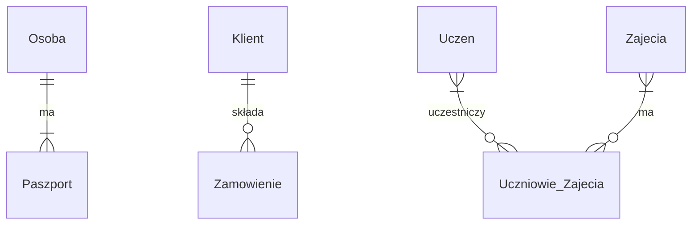

### Typy relacji w bazach danych

W relacyjnych bazach danych, jak SQLite, relacje między tabelami odgrywają kluczową rolę w projektowaniu i organizacji danych. Relacja odnosi się do sposobu, w jaki tabele są ze sobą powiązane za pomocą kluczy (głównie kluczy głównych i obcych). Wyróżniamy trzy główne typy relacji:

1. **Relacja jeden do jednego (1:1)**
2. **Relacja jeden do wielu (1:N)**
3. **Relacja wiele do wielu (M:N)**

Każdy z tych typów relacji ma swoje specyficzne zastosowanie, które pomaga w przechowywaniu, organizacji i łatwiejszym dostępie do danych.

---

### 1. Relacja jeden do jednego (1:1)

W relacji jeden do jednego (1:1) jeden rekord w tabeli A odpowiada dokładnie jednemu rekordowi w tabeli B. Obie tabele mają unikalne powiązania.

#### Przykład

Wyobraź sobie, że masz dwie tabele:

- `Employees` (Pracownicy)
- `EmployeeDetails` (Szczegóły pracowników)

Każdy pracownik ma unikalne szczegóły, np. prywatny numer ubezpieczenia społecznego, który nie jest potrzebny we wspólnej tabeli pracowników.

```sql
CREATE TABLE Employees (
    EmployeeID INTEGER PRIMARY KEY,
    FirstName TEXT,
    LastName TEXT
);

CREATE TABLE EmployeeDetails (
    EmployeeID INTEGER PRIMARY KEY,
    SocialSecurityNumber TEXT,
    FOREIGN KEY(EmployeeID) REFERENCES Employees(EmployeeID)
);
```

**Opis:** Każdy pracownik w tabeli `Employees` ma dokładnie jeden powiązany rekord w tabeli `EmployeeDetails`. Jest to przykład relacji 1:1.

---

### 2. Relacja jeden do wielu (1:N)

W relacji jeden do wielu (1:N) jeden rekord w tabeli A może być powiązany z wieloma rekordami w tabeli B, ale rekord w tabeli B może być powiązany tylko z jednym rekordem w tabeli A.

#### Przykład

Tabela `Customers` (Klienci) i `Orders` (Zamówienia) — każdy klient może mieć wiele zamówień, ale każde zamówienie należy do jednego klienta.

```sql
CREATE TABLE Customers (
    CustomerID INTEGER PRIMARY KEY,
    CustomerName TEXT
);

CREATE TABLE Orders (
    OrderID INTEGER PRIMARY KEY,
    OrderDate DATE,
    CustomerID INTEGER,
    FOREIGN KEY(CustomerID) REFERENCES Customers(CustomerID)
);
```

**Opis:** Każdy klient w tabeli `Customers` może mieć wiele zamówień w tabeli `Orders`. Każde zamówienie jest przypisane tylko do jednego klienta.

---

### 3. Relacja wiele do wielu (M:N)

W relacji wiele do wielu (M:N) jeden rekord w tabeli A może być powiązany z wieloma rekordami w tabeli B, a jeden rekord w tabeli B może być powiązany z wieloma rekordami w tabeli A. Aby taką relację zrealizować, potrzebujemy tabeli pośredniczącej, która będzie przechowywała klucze obce z obu tabel.

#### Przykład

Tabela `Students` (Studenci) i `Courses` (Kursy) — student może uczęszczać na wiele kursów, a kurs może mieć wielu studentów.

```sql
CREATE TABLE Students (
    StudentID INTEGER PRIMARY KEY,
    StudentName TEXT
);

CREATE TABLE Courses (
    CourseID INTEGER PRIMARY KEY,
    CourseName TEXT
);

CREATE TABLE StudentCourses (
    StudentID INTEGER,
    CourseID INTEGER,
    PRIMARY KEY (StudentID, CourseID),
    FOREIGN KEY (StudentID) REFERENCES Students(StudentID),
    FOREIGN KEY (CourseID) REFERENCES Courses(CourseID)
);
```

**Opis:** Tabela `StudentCourses` służy jako tabela pośrednicząca, która łączy studentów z kursami. Dzięki temu jeden student może uczęszczać na wiele kursów, a każdy kurs może mieć wielu studentów.

---

### Podsumowanie

Typy relacji w bazach danych są kluczowe dla efektywnego przechowywania danych i zapewnienia ich integralności. Prawidłowe zrozumienie relacji pomaga w lepszym projektowaniu bazy danych:

1. **1:1 (jeden do jednego)** – jeden rekord w jednej tabeli jest powiązany z jednym rekordem w drugiej.
2. **1:N (jeden do wielu)** – jeden rekord w jednej tabeli jest powiązany z wieloma rekordami w drugiej.
3. **M:N (wiele do wielu)** – wiele rekordów w jednej tabeli może być powiązanych z wieloma rekordami w drugiej, co realizowane jest przez tabelę pośredniczącą.

### Mapa myśli


## Relacje jeden do jednego (1:1)

**Relacje jeden do jednego (1:1) w bazach danych**

W relacyjnych bazach danych, takich jak SQLite, relacje jeden do jednego (1:1) oznaczają, że jeden wiersz w jednej tabeli jest powiązany z maksymalnie jednym wierszem w innej tabeli, i vice versa. Można to porównać do sytuacji, w której każdy uczeń w szkole ma przypisany jeden numer szafki, a każda szafka jest przypisana do jednego ucznia.

**Kiedy stosować relacje 1:1**

Relacje 1:1 są stosowane rzadziej niż inne typy relacji (np. jeden do wielu czy wiele do wielu), ale mają swoje zastosowania w określonych sytuacjach:

1. **Dane dodatkowe lub opcjonalne:** Gdy chcemy przechowywać dodatkowe informacje o encji, które nie są wymagane dla wszystkich wystąpień tej encji. Na przykład, w tabeli "Pracownicy" możemy mieć podstawowe informacje o każdym pracowniku, takie jak imię, nazwisko i stanowisko. Dodatkowo, możemy utworzyć tabelę "Samochody służbowe" i powiązać ją relacją 1:1 z tabelą "Pracownicy", aby przechowywać informacje o samochodach służbowych tylko dla tych pracowników, którzy je posiadają.

2. **Dane poufne lub wrażliwe:** Gdy chcemy oddzielić dane poufne lub wrażliwe od reszty danych w bazie. Na przykład, w tabeli "Użytkownicy" możemy przechowywać podstawowe informacje o użytkownikach, takie jak nazwa użytkownika i hasło. Dodatkowo, możemy utworzyć tabelę "Dane osobowe" i powiązać ją relacją 1:1 z tabelą "Użytkownicy", aby przechowywać bardziej szczegółowe dane osobowe, takie jak adres czy numer telefonu, w oddzielnej tabeli, która może być lepiej zabezpieczona.

3. **Dziedziczenie:** Gdy chcemy modelować różne typy encji, które mają pewne wspólne atrybuty, ale także unikalne atrybuty dla każdego typu. Na przykład, możemy mieć encję "Osoba" z atrybutami takimi jak imię i nazwisko, a następnie utworzyć encje "Student" i "Pracownik", które dziedziczą atrybuty z encji "Osoba" i mają swoje własne unikalne atrybuty. Możemy wtedy utworzyć relacje 1:1 między encją "Osoba" a encjami "Student" i "Pracownik".

4. **Optymalizacja wydajności:** W niektórych przypadkach relacje 1:1 mogą być stosowane do optymalizacji wydajności bazy danych, szczególnie gdy mamy do czynienia z dużymi tabelami i rzadko używanymi atrybutami. Przeniesienie rzadko używanych atrybutów do oddzielnej tabeli powiązanej relacją 1:1 może zmniejszyć rozmiar głównej tabeli i przyspieszyć zapytania, które nie wymagają tych dodatkowych informacji.

**Proces decyzyjny dotyczący stosowania relacji 1:1**

Przed zastosowaniem relacji 1:1 warto rozważyć następujące czynniki:

- **Czy dane są opcjonalne lub rzadko używane?** Jeśli tak, relacja 1:1 może być dobrym rozwiązaniem, aby uniknąć przechowywania pustych wartości w głównej tabeli.
- **Czy dane są poufne lub wrażliwe?** Jeśli tak, relacja 1:1 może pomóc w lepszym zabezpieczeniu tych danych.
- **Czy chcemy modelować dziedziczenie?** Jeśli tak, relacje 1:1 mogą być użyte do reprezentowania relacji między encją bazową a encjami pochodnymi.
- **Czy potrzebujemy optymalizacji wydajności?** Jeśli tak, relacja 1:1 może pomóc w zmniejszeniu rozmiaru głównej tabeli i przyspieszeniu zapytań.

**Alternatywne podejścia**

W niektórych przypadkach, zamiast stosować relację 1:1, możemy rozważyć inne podejścia:

- **Dodanie kolumn do istniejącej tabeli:** Jeśli dodatkowe atrybuty są wymagane dla wszystkich lub większości wystąpień encji, możemy po prostu dodać je jako nowe kolumny do istniejącej tabeli.
- **Użycie kolumny typu JSON:** Jeśli dodatkowe atrybuty są złożone lub mają zmienną strukturę, możemy przechowywać je w kolumnie typu JSON.
- **Użycie tabel tymczasowych lub widoków:** Jeśli potrzebujemy dodatkowych danych tylko do konkretnych zapytań lub raportów, możemy utworzyć tabele tymczasowe lub widoki, zamiast tworzyć trwałe relacje 1:1.

## Relacje jeden do wielu (1:N)

**Czym są relacje 1:N?**

Relacja jeden do wielu (1:N) oznacza, że jeden wiersz w jednej tabeli może być powiązany z wieloma wierszami w innej tabeli, ale każdy wiersz w drugiej tabeli może być powiązany tylko z jednym wierszem w pierwszej tabeli. Możemy to porównać do relacji między nauczycielem a uczniami w klasie: jeden nauczyciel uczy wielu uczniów, ale każdy uczeń ma tylko jednego nauczyciela w tej klasie.

**Kiedy stosować relacje 1:N**

Relacje 1:N są stosowane w wielu sytuacjach, gdy chcemy modelować hierarchiczne lub zależne związki między encjami. Oto kilka typowych przypadków użycia:

1. **Kategorie i elementy:** Gdy mamy encję reprezentującą kategorię i encję reprezentującą elementy należące do tej kategorii. Na przykład, w sklepie internetowym możemy mieć tabelę "Kategorie" i tabelę "Produkty". Każda kategoria może zawierać wiele produktów, ale każdy produkt należy tylko do jednej kategorii.

2. **Zamówienia i pozycje zamówienia:** Gdy mamy encję reprezentującą zamówienie i encję reprezentującą poszczególne pozycje w zamówieniu. Każde zamówienie może zawierać wiele pozycji, ale każda pozycja należy tylko do jednego zamówienia.

3. **Klienci i faktury:** Gdy mamy encję reprezentującą klienta i encję reprezentującą faktury wystawione temu klientowi. Każdy klient może mieć wiele faktur, ale każda faktura należy tylko do jednego klienta.

4. **Departamenty i pracownicy:** Gdy mamy encję reprezentującą departament i encję reprezentującą pracowników zatrudnionych w tym departamencie. Każdy departament może mieć wielu pracowników, ale każdy pracownik należy tylko do jednego departamentu.

**Proces decyzyjny dotyczący stosowania relacji 1:N**

Przed zastosowaniem relacji 1:N warto zadać sobie następujące pytania:

- **Czy jedna encja może być powiązana z wieloma encjami innego typu?** Jeśli tak, relacja 1:N może być odpowiednia.
- **Czy każda encja drugiego typu może być powiązana tylko z jedną encją pierwszego typu?** Jeśli tak, relacja 1:N jest właściwym wyborem.
- **Czy relacja między encjami jest hierarchiczna lub zależna?** Jeśli tak, relacja 1:N może pomóc w modelowaniu tej zależności.

**Przykłady relacji 1:N**

- **Klient - Zamówienia:** Jeden klient może złożyć wiele zamówień.
- **Kategoria - Produkty:** Jedna kategoria może zawierać wiele produktów.
- **Autor - Książki:** Jeden autor może napisać wiele książek.
- **Kraj - Miasta:** Jeden kraj może mieć wiele miast.

**Podsumowanie**

Relacje jeden do wielu (1:N) są podstawowym elementem projektowania relacyjnych baz danych. Pozwalają nam modelować hierarchiczne i zależne związki między encjami, zapewniając spójność i integralność danych.

**Czy masz jakieś pytania dotyczące relacji jeden do wielu lub chciałbyś zobaczyć przykład takiego zastosowania w praktyce?**

## Relacje M:N

**Czym są relacje M:N?**

Relacja wiele do wielu (M:N) oznacza, że wiele wierszy w jednej tabeli może być powiązanych z wieloma wierszami w innej tabeli. Możemy to porównać do relacji między uczniami a zajęciami w szkole: jeden uczeń może uczęszczać na wiele zajęć, a każde zajęcia mogą mieć wielu uczniów.

**Kiedy stosować relacje M:N**

Relacje M:N są stosowane, gdy chcemy modelować związki, w których wiele wystąpień jednej encji może być powiązanych z wieloma wystąpieniami innej encji. Oto kilka typowych przypadków użycia:

1. **Uczniowie i zajęcia:** Jak wspomniano wcześniej, jeden uczeń może uczęszczać na wiele zajęć, a każde zajęcia mogą mieć wielu uczniów.

2. **Aktorzy i filmy:** Jeden aktor może zagrać w wielu filmach, a każdy film może mieć wielu aktorów.

3. **Produkty i zamówienia:** Jedno zamówienie może zawierać wiele produktów, a każdy produkt może być częścią wielu zamówień.

4. **Tagi i artykuły:** Jeden artykuł może mieć wiele tagów, a każdy tag może być przypisany do wielu artykułów.

**Proces decyzyjny dotyczący stosowania relacji M:N**

Przed zastosowaniem relacji M:N warto zadać sobie następujące pytania:

- **Czy wiele wystąpień jednej encji może być powiązanych z wieloma wystąpieniami innej encji?** Jeśli tak, relacja M:N może być odpowiednia.
- **Czy relacja między encjami jest symetryczna?** To znaczy, czy obie encje mogą być powiązane z wieloma encjami drugiego typu? Jeśli tak, relacja M:N jest właściwym wyborem.

**Implementacja relacji M:N**

Relacje M:N nie mogą być bezpośrednio reprezentowane w relacyjnych bazach danych. Aby je zaimplementować, potrzebujemy tabeli pośredniczącej (zwanej również tabelą łączącą), która przechowuje klucze obce odwołujące się do obu tabel uczestniczących w relacji.

**Przykład implementacji relacji M:N**

Załóżmy, że mamy tabele `Uczniowie` i `Zajecia`. Aby utworzyć relację M:N między nimi, potrzebujemy tabeli pośredniczącej `Uczniowie_Zajecia`:

```sql
CREATE TABLE Uczniowie (
    id_ucznia INTEGER PRIMARY KEY,
    imie VARCHAR(50),
    nazwisko VARCHAR(50)
);

CREATE TABLE Zajecia (
    id_zajec INTEGER PRIMARY KEY,
    nazwa_zajec VARCHAR(100)
);

CREATE TABLE Uczniowie_Zajecia (
    id_ucznia INTEGER,
    id_zajec INTEGER,
    PRIMARY KEY (id_ucznia, id_zajec),
    FOREIGN KEY (id_ucznia) REFERENCES Uczniowie(id_ucznia),
    FOREIGN KEY (id_zajec) REFERENCES Zajecia(id_zajec)
);
```

W tabeli `Uczniowie_Zajecia` przechowujemy pary `id_ucznia` i `id_zajec`, które reprezentują powiązania między uczniami a zajęciami.

**Podsumowanie**

Relacje wiele do wielu (M:N) są ważnym narzędziem do modelowania złożonych związków między danymi. Chociaż wymagają one dodatkowej tabeli pośredniczącej, umożliwiają elastyczne i efektywne przechowywanie informacji o powiązaniach między wieloma encjami.

## Realizacja realacji za pomocą języka SQL

- **Relacja jeden do jednego (1:1)**: Jeden wiersz w jednej tabeli jest powiązany z maksymalnie jednym wierszem w innej tabeli, i vice versa.
- **Relacja jeden do wielu (1:N)**: Jeden wiersz w jednej tabeli może być powiązany z wieloma wierszami w innej tabeli, ale każdy wiersz w drugiej tabeli może być powiązany tylko z jednym wierszem w pierwszej tabeli.
- **Relacja wiele do wielu (M:N)**: Wiele wierszy w jednej tabeli może być powiązanych z wieloma wierszami w innej tabeli.

**Implementacja w SQL**

**1. Relacja jeden do jednego (1:1)**

```sql
CREATE TABLE Osoby (
    id_osoby INTEGER PRIMARY KEY,
    imie VARCHAR(50),
    nazwisko VARCHAR(50)
);

CREATE TABLE Paszporty (
    id_paszportu INTEGER PRIMARY KEY,
    numer_paszportu VARCHAR(20),
    id_osoby INTEGER UNIQUE,
    FOREIGN KEY (id_osoby) REFERENCES Osoby(id_osoby)
);
```

W tym przykładzie każda osoba może mieć maksymalnie jeden paszport, a każdy paszport jest przypisany do jednej osoby. Osiągamy to poprzez dodanie ograniczenia `UNIQUE` do kolumny `id_osoby` w tabeli `Paszporty`.

**2. Relacja jeden do wielu (1:N)**

```sql
CREATE TABLE Klienci (
    id_klienta INTEGER PRIMARY KEY,
    imie VARCHAR(50),
    nazwisko VARCHAR(50)
);

CREATE TABLE Zamowienia (
    id_zamowienia INTEGER PRIMARY KEY,
    data_zamowienia DATE,
    id_klienta INTEGER,
    FOREIGN KEY (id_klienta) REFERENCES Klienci(id_klienta)
);
```

Tutaj jeden klient może złożyć wiele zamówień, ale każde zamówienie jest przypisane tylko do jednego klienta. Klucz obcy `id_klienta` w tabeli `Zamowienia` zapewnia tę relację.

**3. Relacja wiele do wielu (M:N)**

```sql
CREATE TABLE Uczniowie (
    id_ucznia INTEGER PRIMARY KEY,
    imie VARCHAR(50),
    nazwisko VARCHAR(50)
);

CREATE TABLE Zajecia (
    id_zajec INTEGER PRIMARY KEY,
    nazwa_zajec VARCHAR(100)
);

CREATE TABLE Uczniowie_Zajecia (
    id_ucznia INTEGER,
    id_zajec INTEGER,
    PRIMARY KEY (id_ucznia, id_zajec),
    FOREIGN KEY (id_ucznia) REFERENCES Uczniowie(id_ucznia),
    FOREIGN KEY (id_zajec) REFERENCES Zajecia(id_zajec)
);
```

W tym przypadku wielu uczniów może uczęszczać na wiele zajęć. Aby to zrealizować, potrzebujemy tabeli pośredniczącej `Uczniowie_Zajecia`, która przechowuje pary `id_ucznia` i `id_zajec`, reprezentujące powiązania między uczniami a zajęciami.

**Podsumowanie różnic**

- **1:1:** Każdy wiersz w jednej tabeli jest powiązany z maksymalnie jednym wierszem w innej tabeli. Implementacja zazwyczaj wymaga ograniczenia `UNIQUE` na kluczu obcym.
- **1:N:** Jeden wiersz w jednej tabeli może być powiązany z wieloma wierszami w innej tabeli. Implementacja wymaga klucza obcego w tabeli "wiele".
- **M:N:** Wiele wierszy w jednej tabeli może być powiązanych z wieloma wierszami w innej tabeli. Implementacja wymaga dodatkowej tabeli pośredniczącej z dwoma kluczami obcymi.

### Relacjce



Wyjaśnienie:

- Osoba Paszport : "ma" - Relacja jeden do jednego (1:1) między encjami Osoba i Paszport. Oznacza to, że jedna osoba może mieć maksymalnie jeden paszport, a każdy paszport jest przypisany do jednej osoby.
- Klient zamowienie : "składa" - Relacja jeden do wielu (1:N) między encjami Klient i Zamowienie. Oznacza to, że jeden klient może złożyć wiele zamówień, ale każde zamówienie jest przypisane tylko do jednego klienta.
- Wielu uczniów może uczęszczać na wiele zajęć, a każde zajęcia mogą mieć wielu uczniów.

Legenda:

`||--||` - Relacja jeden do jednego (1:1)
`||--o{` - Relacja jeden do wielu (1:N)
`}|--o{` - Relacja wiele do wielu (M:N) reprezentowana przez tabelę pośredniczącą
